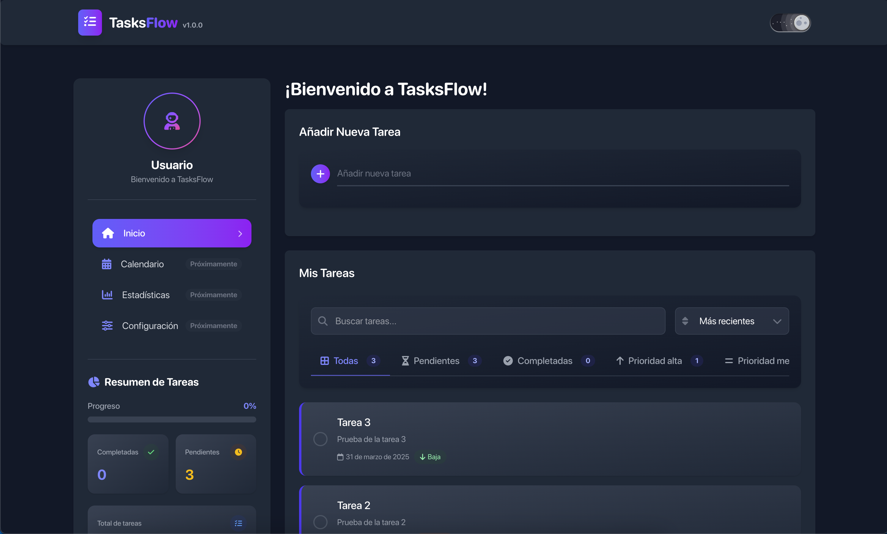

# TasksFlow - Gestión de Tareas

TasksFlow es una aplicación moderna de gestión de tareas construida con React, Redux, Vite y TailwindCSS. Permite a los usuarios crear, organizar y realizar un seguimiento de sus tareas de manera eficiente con una interfaz atractiva y fácil de usar.



## 🚀 Características

- ✅ Crear, editar y eliminar tareas
- 📋 Marcar tareas como completadas
- 🔍 Filtrar y buscar tareas por estado y prioridad
- 📅 Vista de calendario para visualizar tareas por fecha límite
- 📊 Panel de estadísticas con tasa de finalización y distribución por prioridad
- ⚙️ Configuración: cambio de tema, exportación/importación de datos y borrado de datos
- 🌓 Modo oscuro/claro
- 📱 Diseño responsive para dispositivos móviles y de escritorio
- 💾 Almacenamiento local (localStorage) para persistencia de datos, con manejo robusto de errores
- ✨ Animaciones fluidas con Framer Motion
- 🎨 Interfaz de usuario moderna con TailwindCSS y MUI

## 📋 Requisitos previos

- Node.js (v18.0.0 o superior)
- npm, yarn o pnpm

## 🛠️ Instalación

1. Clonar el repositorio:
```bash
git clone https://github.com/AnderCMD/TasksFlow.git
cd TasksFlow
```

2. Instalar dependencias:
```bash
# Con npm
npm install

# Con pnpm
pnpm install
```

3. Iniciar el servidor de desarrollo:
```bash
# Con npm
npm run dev

# Con pnpm
pnpm run dev
```

4. Abrir [http://localhost:5173](http://localhost:5173) en el navegador.

## ✅ Scripts disponibles

```bash
pnpm run dev        # Servidor de desarrollo
pnpm run build      # Build de producción
pnpm run preview    # Previsualizar el build de producción
pnpm run lint       # Analizar el código con ESLint
pnpm run test       # Ejecutar la suite de pruebas (Vitest)
pnpm run test:watch # Ejecutar pruebas en modo watch
```

## 🏗️ Estructura del proyecto

```
tasksflow/
├── public/                 # Archivos estáticos
├── src/                    # Código fuente
│   ├── App/                # Configuración global de la aplicación
│   │   └── store.js        # Configuración de Redux store
│   ├── Assets/             # Recursos (imágenes, iconos, etc.)
│   ├── Components/         # Componentes reutilizables
│   │   ├── Layout/         # Componentes de estructura
│   │   ├── Tasks/          # Componentes específicos de tareas
│   │   └── UI/             # Componentes de interfaz genéricos (tema, error boundary)
│   ├── Features/           # Características con sus slices de Redux
│   │   ├── Tasks/          # Gestión de tareas
│   │   └── Theme/          # Gestión del tema
│   ├── Pages/              # Páginas enrutadas (Inicio, Calendario, Estadísticas, Configuración)
│   ├── Utils/              # Utilidades compartidas (p. ej. acceso seguro a localStorage)
│   ├── Styles/             # Estilos globales
│   ├── App.jsx             # Componente principal y definición de rutas
│   ├── index.css           # Estilos globales
│   └── main.jsx            # Punto de entrada
├── index.html              # Plantilla HTML
├── vite.config.js          # Configuración de Vite
├── package.json            # Dependencias y scripts
└── README.md               # Documentación
```

## 🧠 Decisiones de arquitectura

### Redux Toolkit

Se utiliza Redux Toolkit para el manejo del estado global de la aplicación, siguiendo un patrón de arquitectura basado en características (feature-based), lo que facilita la organización y el mantenimiento del código.

### Almacenamiento local

Las tareas se almacenan en el localStorage del navegador, lo que permite que los datos persistan entre sesiones sin necesidad de una base de datos o API externa.

### Modo oscuro

La aplicación incluye un sistema de temas que permite cambiar entre modo claro y oscuro, utilizando las capacidades de TailwindCSS para clases condicionales.

### Animaciones

Se utiliza Framer Motion para añadir animaciones fluidas que mejoran la experiencia de usuario al interactuar con los elementos de la interfaz.

## 🧪 Tecnologías utilizadas

- [React](https://reactjs.org/) - Biblioteca para construir interfaces de usuario
- [React Router](https://reactrouter.com/) - Enrutamiento del lado del cliente
- [Redux Toolkit](https://redux-toolkit.js.org/) - Herramientas para simplificar la lógica de Redux
- [Vite](https://vitejs.dev/) - Entorno de desarrollo rápido
- [Vitest](https://vitest.dev/) + [Testing Library](https://testing-library.com/) - Pruebas unitarias
- [TailwindCSS](https://tailwindcss.com/) - Framework CSS utilitario
- [MUI (Material-UI)](https://mui.com/) - Componentes de React basados en Material Design
- [Framer Motion](https://www.framer.com/motion/) - Biblioteca de animaciones para React

## 🔍 Mejoras futuras

- Integración con backend para sincronización de datos entre dispositivos
- Sistema de autenticación de usuarios
- Categorías y etiquetas para organizar tareas
- Notificaciones y recordatorios
- Funcionalidad de arrastrar y soltar (drag and drop)
- Soporte multi-idioma (i18n)

## 🤝 Contribuir

Las contribuciones son bienvenidas. Lee la [guía de contribución](CONTRIBUTING.md)
para más detalles sobre cómo configurar el entorno y enviar cambios. Este
proyecto sigue un [Código de conducta](CODE_OF_CONDUCT.md).

## 🔒 Seguridad

Si encuentras una vulnerabilidad de seguridad, por favor consulta la
[política de seguridad](SECURITY.md) para reportarla de forma responsable.

## 🔤 Tipografía

La interfaz usa [M PLUS Rounded 1c](https://fonts.google.com/specimen/M+PLUS+Rounded+1c),
una tipografía redondeada de licencia abierta (OFL-1.1), autoalojada mediante
[Fontsource](https://fontsource.org/) para que la app funcione sin
dependencias externas ni restricciones de licencia.

## 📄 Licencia

Este proyecto está bajo la licencia MIT. Ver el archivo `LICENSE` para más detalles.

## 👨‍💻 Autor

[AnderCMD](https://github.com/AnderCMD)
[andercmd@outlook.com](mailto:andercmd@outlook.com)
[Portafolio](https://andercmd.dev)

---

¡Gracias por utilizar TasksFlow! Esperamos que esta herramienta te ayude a organizar tus tareas de manera eficiente. Si tienes alguna sugerencia o encuentras algún problema, no dudes en abrir un issue en GitHub.
